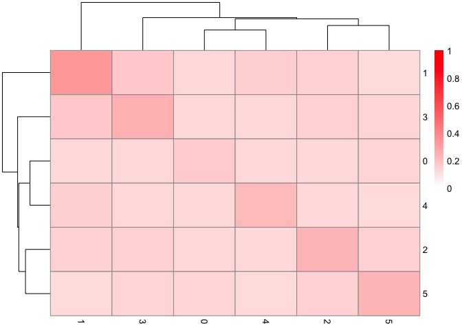

One of my roommates is a statistics PhD so I thought I might try looking at a
statistics paper. Or, honestly, just the code from a statistics paper. Actually
understanding the entire paper would require way more time than I am willing to
devote to a single blog post.

This month's paper: Nicol PB and Miller JW. Model-based dimensionality reduction 
for single-cell RNA-seq using generalized bilinear models. *Biostatistics* 2025. 
doi: [10.1093/biostatistics/kxaf024][DOI]

## Original code

This paper's code is on [GitHub][Code].

## Critique

*Standard disclaimer: issues with published code are not necessarily anyone's
fault, and often are due to nothing more nefarious than time constraints.*

### Give your code some space

This paper released an R package. Its [README][MarkdownREADME] has code samples. Unfortunately for my eyes, the writer seems to not like the spacebar. See:

```r
I <- 500
J <- 500
Y <- matrix(rpois(I*J,lambda=1),nrow=I,ncol=J)
colnames(Y) <- 1:J; rownames(Y) <- 1:I
```

By inserting a few spaces, we can make that third line scan better:

```r
Y <- matrix(rpois(I*J, lambda=1), nrow=I, ncol=J)
```

Spaces between each of the arguments makes it easier to visually separate them.
Now I can see that `I` goes with `nrow` instead of `ncol`.

Then later we have:

```r
library(Seurat)
Sco <- CreateSeuratObject(counts=Y)
colnames(out$scores) <- 1:10
Sco[["gbm"]] <- CreateDimReducObject(embeddings=out$scores,key="GBM_")
Sco <- FindNeighbors(Sco,reduction = "gbm")
Sco <- FindClusters(Sco)
```

Note that second-to-last line. It would be easier to scan which parts go
together if spaces were between _arguments_ and not around the `=` sign. The
other [keyword arguments][KeywordBlog] don't use spaces around the `=`. Dunno
why they exist here. Be consistent, folks!

### Providing example outputs is good

The demo includes not only code samples, but also what that code outputs. That
might seem small, or like a waste of space if the reader is focusing on code
examples, but it's incredibly important.

* A user can **follow along with the code samples** and compare their output 
against the examples. This is great for trying out a new package. It's also a
boon to debugging help to figure out if a problem comes from the package or if
you're just using it wrong.
* It's easy to **figure out what this package can do** by simply scanning the
outputs. If I'm want, say, bespoke heatmaps, then it helps to see examples of 
what a given package can do. I can then decide whether to invest more time.
* If the outputs are automatically generated, they **provide a sort of test**.
Note that this README has an [RMarkdown version][RmdREADME]. If that fails to 
produce one of the demo plots, then Houston, we have a problem.

### ... but those example outputs should be usable

One of the example outputs is this heatmap:



Um. What is this? I understand this is just an example, but I'd like to be able
to look at it and understand what it's an example _of_. This isn't a blog on how
to make good plots, I know, but... at least put usable labels? I think those
numbers on the side correspond to clusters. Just slap "cluster" on as an axis
label, and then a casual reader will instantly understand the point of making
this plot. It shows similarities between clusters! That's something you want to
sell as a functionality. I think. I dunno what stats people are looking for.

In general, if you're displaying an example output in a bid to sell your package
as a useful tool, it would help for that example output to be a *good example*
of what someone might actually use. Think of each output as a pitch for your
tool. If it's a good pitch by itself, people will remember it well. And by
extension, they'll remember your tool.

----

If there's a recent paper you'd like me to look through, shoot me an email.
Address in my [CV][CV].

[Code]: https://github.com/phillipnicol/scGBM
[CV]: https://faithokamoto.github.io/cv/
[DOI]: https://doi.org/10.1093/biostatistics/kxaf024
[KeywordBlog]: https://faithokamoto.github.io/2024-10-26-keyword-arguments/
[MarkdownREADME]: https://github.com/phillipnicol/scGBM/blob/master/README.md
[RmdREADME]: https://github.com/phillipnicol/scGBM/blob/master/README.Rmd